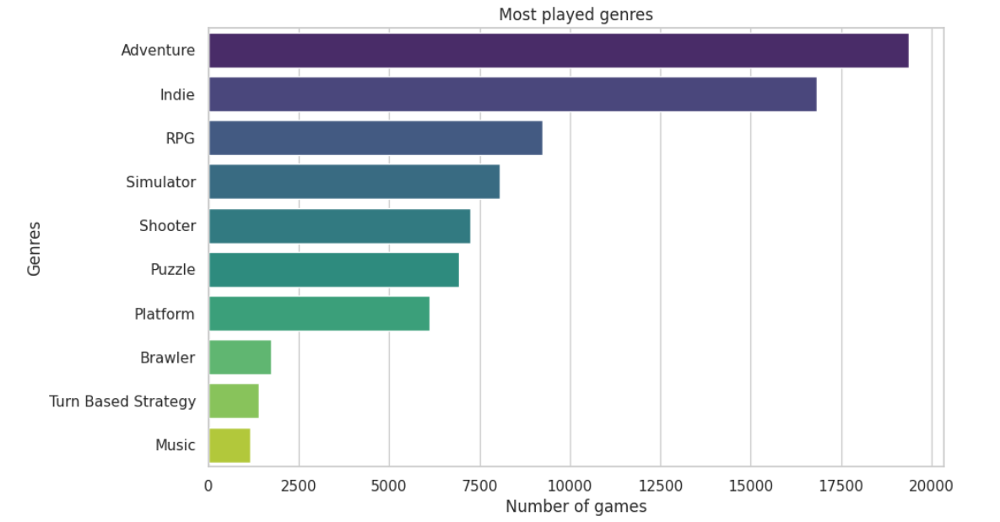

# Market Analysis Report for Games

## Overview

This repository contains the market analysis report for games, providing insights into the average rating of games and the most played game genres in the market.

## Analysis Details

### Point 1: Average Rating in the Game Market

The analysis reveals that the average rating of games in the market stands at 3.3 stars.

### Point 2: Most Played Game Genres

According to the analysis, the most played genres in the game market are as follows, along with their respective point values:

- Adventure: 19500 points
- Indie: 16500 points
- RPG (Role-playing Game): 9000 points
- Simulator: 8000 points
- Shooter: 6000 points

## Methodology

### Average Rating Calculation

The average rating was calculated by aggregating the ratings of multiple games across different platforms and computing their mean.

### Genre Ranking

The genre ranking was determined by analyzing the popularity and player engagement metrics of various game genres across different gaming platforms and communities.

## Summary

This report provides valuable insights into the game market, aiding developers and stakeholders in understanding player preferences and market trends.

### Graph, Most Played Game Genres

